<h1 align="center">
  <!-- Animated rocket with trail -->
  
  <!-- Main name with animated gradient -->
  <span style="background: linear-gradient(45deg, #7e22ce, #3b82f6, #10b981); 
              background-size: 300% 300%;
              -webkit-background-clip: text;
              -webkit-text-fill-color: transparent;
              animation: gradient 5s ease infinite;
              font-weight: 800;
              padding: 0 10px;">
    Lokeshwaran V
  </span>
  
  <!-- Sparkle animation -->
</h1>

<!-- Animated typing text with custom colors -->
<p align="center">
  
</p>


---

### 🧙‍♂️ Tech Wizardry

<p align="center">
  
</p>
---

### 💼 Professional Journey

#### 🔍 **Hyperready** | Software Developer Intern (Auditing Domain) | May 2025 - Present
```diff
+ Ledger Validation | Compliance Testing | Data Mapping | UI Enhancements
```
- Building automation platform to reduce manual auditing work
- Implementing workflow automation tools
- Collaborating on application reliability improvements

#### ⌚ **Titan Company Ltd** | Frontend Developer Intern | Nov 2024 - Dec 2024
```diff
+ React | Timesheet Management | UI Optimization
```
- Developed timesheet management application
- Built responsive UI components
- Optimized application performance

#### 🚚 **Wheels on Technologies** | Web Developer Intern | Jul 2024 - Aug 2024
```diff
+ Supplier Calculator | Geo Algorithms | Logistics Tech
```
- Created web-based price calculator
- Implemented distance calculation algorithms
- Integrated with logistics systems

---

### � Highlight Projects


| Project | Tech Stack | Highlights |
|---------|------------|------------|
| **📊 Timesheet Management** | MERN Stack | Real-time tracking, JWT auth |
| **🤖 GPT Clone** | React + Gemini API | Dynamic conversations |
| **📦 Price Calculator** | Node.js + MongoDB | Geo-based algorithms |
| **📝 Project Management** | React.js + Node.js | Team collaboration |

---

### 🏆 Achievement Wall

```mermaid
journey
  title My Coding Journey
  section Competitions
    🥇 Carta Presentara: 5: 2024
    🥈 Reverse Engineering: 4: 2024
  section Coding
    ✅ 600+ LeetCode: 7: 2025
    💯 100-Day Challenge: 8: 2024
  section Certifications
    🎖️ NPTEL Elite: 5: 2024
    📜 MERN Stack: 7: 2025
```



---

### 📊 GitHub Analytics


  <p align="center">
    
  </p>


---

### 🌐 Connect With Me

<p align="center">
  <a href="https://linkedin.com/in/lokeshwaran-v-680827257">
    
  </a>
  <a href="https://leetcode.com/u/Lokeshwaran_V">
    
  </a>
  <a href="https://loki-profile.netlify.app">
    
  </a>
  <a href="mailto:lokeshv1w2004@gmail.com">
    
  </a>
</p>

<p align="center">
  
</p>
```
